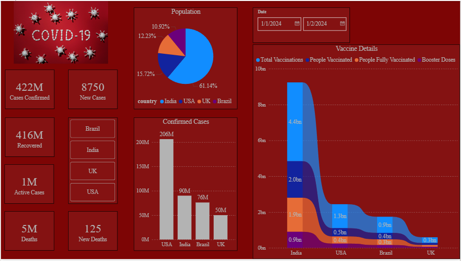

# COVID-19 Data Analytics Project 📊
## Project Overview
This project focuses on analyzing COVID-19 data by combining multiple datasets and performing data analysis using SQL, Python, and Power BI. The goal of the project is to explore trends in COVID cases, vaccinations, and demographics and present insights through an interactive dashboard.
The project demonstrates skills in data cleaning, data merging, SQL database integration, exploratory data analysis (EDA), and data visualization.

## Tech Stack 🛠️
- Python
- Pandas
- Matplotlib
- SQL (MySQL)
- Power BI
- GitHub

## Datasets Used 📂
The analysis uses three different datasets:
 - Country Demographics,
 - Covid Cases,
 - Vaccination Data.
These datasets were merged to create a comprehensive dataset for analysis.

## Project Workflow 🔄
1. Data Collection: Multiple datasets related to COVID were collected and loaded into Python for analysis.
2. Data Exploration: Initial data exploration was done using Pandas functions.These functions helped understand:
   Data structure,Missing values,Statistical summary of the dataset
3. Data Merging: The datasets were combined using Pandas merge to create a unified dataset.
4. Database Integration: The processed dataset was stored in a MySQL database using SQLAlchemy.Data was then retrieved using SQL queries.
5. Exploratory Data Analysis(EDA): EDA was performed using Pandas and Matplotlib.
6. Power BI Dashboard: The cleaned dataset was imported into Power BI to build an interactive dashboard.The dashboard includes:
   Total COVID Cases,
   Vaccination details,
   Country-wise Analysis,etc.,.

## Dashboard Preview 🖼️

## Project Link 🔗
GitHub Repository:  
https://github.com/Ruthra2198/covid-data-analysis

## Project Structure 📁
covid-data-analytics-project
│
├── data
│   ├── covid_data.csv
├── python_sql
│   └── CovidDataAnalysis.ipynb
├── powerbi
│   └── CovidAnalysis.pbix
└── README.md

## Key Skills Demonstrated 💡
- Data Cleaning and Preprocessing
- Data Merging and Transformation
- SQL Database Integration
- Data Visualization
- End-to-End Data Analytics Workflow

GitHub Profile: https://github.com/Ruthra2198
